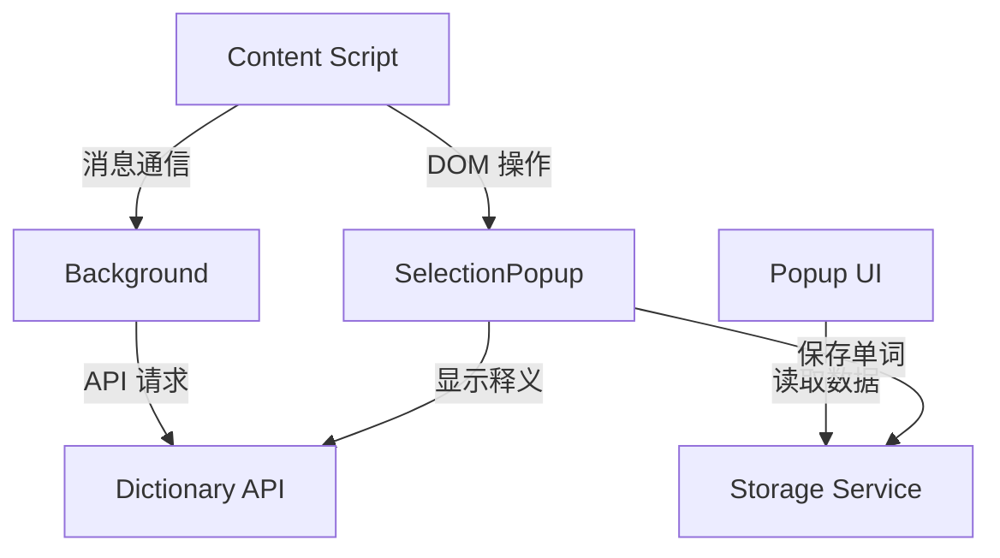
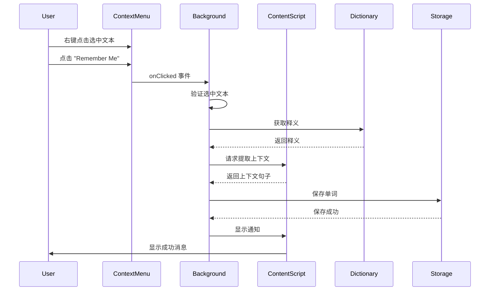

# Design Document

## Overview

词汇量计数器是一个基于 WXT + Vue 3 的浏览器插件，用于帮助英语学习者追踪和管理不认识的单词。插件通过 Content Script 在网页中注入取词功能，使用 Free Dictionary API 获取单词释义，并通过浏览器本地存储（IndexedDB）持久化保存单词数据和历史记录。

### Technology Stack

- **Framework**: [WXT](https://github.com/wxt-dev/wxt) (Web Extension Tools)
- **UI Framework**: [Vue 3](https://github.com/vuejs/core) (Composition API)
- **Storage**: IndexedDB (通过 WXT storage API)
- **Dictionary API**: [Free Dictionary API](https://github.com/meetDeveloper/freeDictionaryAPI) (https://dictionaryapi.dev/)
- **Build Tool**: [Vite](https://github.com/vitejs/vite) (WXT 内置)
- **Language**: [TypeScript](https://github.com/microsoft/TypeScript)

## Architecture

### Extension Structure

```
vocabulary-counter/
├── entrypoints/
│   ├── background.ts          # Background service worker
│   ├── content.ts              # Content script (取词功能)
│   ├── popup/                  # Popup 界面（单词列表）
│   │   ├── App.vue
│   │   ├── main.ts
│   │   └── index.html
│   └── content.css             # Content script 样式
├── components/
│   ├── SelectionPopup.vue      # 选词弹窗组件
│   ├── WordList.vue            # 单词列表组件
│   ├── WordDetail.vue          # 单词详情组件
│   └── HistoryItem.vue         # 历史记录项组件
├── services/
│   ├── dictionary.ts           # 词典 API 服务
│   ├── storage.ts              # 存储服务
│   └── context-extractor.ts   # 上下文提取服务
├── types/
│   └── index.ts                # TypeScript 类型定义
└── utils/
    └── helpers.ts              # 工具函数
```

### Component Communication



## Components and Interfaces

### 1. Content Script (content.ts)

**职责：**
- 监听用户文本选择事件
- 显示/隐藏 SelectionPopup
- 提取上下文句子
- 与 Background 通信获取释义
- 管理弹窗生命周期，确保多次选词正常工作

**关键功能：**
```typescript
// 监听文本选择
document.addEventListener('mouseup', handleTextSelection);

// 显示弹窗
function showPopup(selectedText: string, position: Position): void;

// 隐藏弹窗（不销毁容器，保持可重用）
function hidePopup(): void;

// 提取上下文
function extractContext(selection: Selection): string;

// 保存单词
async function saveWord(word: string, definition: Definition, context: string): Promise<void>;
```

**Bug 修复说明（Requirement 7）：**
- 问题原因：`hidePopup()` 函数将 `popupContainer.style.display` 设置为 'none'，但没有在 `showPopup()` 中重置为可见状态
- 解决方案：在 `showPopup()` 函数中添加 `popupContainer.style.display = 'block'` 来确保容器可见
- 或者：在 `updatePopupProps()` 中通过 Vue 的响应式系统控制显示状态，而不是直接操作 DOM

### 2. SelectionPopup Component

**Props：**
- `word: string` - 选中的单词
- `position: { x: number, y: number }` - 弹窗位置
- `visible: boolean` - 是否显示

**Events：**
- `@forget` - 用户点击 forget 按钮
- `@remember` - 用户点击 remember 按钮
- `@close` - 关闭弹窗

**UI 结构：**
```
┌─────────────────────────┐
│ word                    │
│ [definition]            │
│ [Remember] [Forget]     │
└─────────────────────────┘
```

### 3. Popup UI (WordList)

**功能模块：**
- 单词列表展示（支持排序）
- 单词详情查看
- 历史记录展示
- 导出/导入功能
- 删除/重置操作

**UI 结构：**
```
┌─────────────────────────────────┐
│ Vocabulary Counter              │
│ [Sort: Count ▼] [Export]        │
├─────────────────────────────────┤
│ □ word1          Count: 5       │
│   Last: 2024-01-15              │
├─────────────────────────────────┤
│ □ word2          Count: 3       │
│   Last: 2024-01-14              │
└─────────────────────────────────┘
```

### 4. Background Service Worker

**职责：**
- 处理 API 请求（避免 CORS 问题）
- 管理插件生命周期
- 处理消息通信
- 管理右键菜单（Context Menu）

**消息类型：**
```typescript
type MessageType = 
  | { type: 'GET_DEFINITION', word: string }
  | { type: 'SAVE_WORD', data: WordData }
  | { type: 'GET_WORDS' }
  | { type: 'DELETE_WORD', word: string }
  | { type: 'SAVE_FROM_CONTEXT_MENU', word: string, url: string };
```

**右键菜单功能（Requirement 8）：**
```typescript
// 创建右键菜单项
browser.contextMenus.create({
  id: 'remember-me',
  title: 'Remember Me',
  contexts: ['selection'],
});

// 监听菜单点击事件
browser.contextMenus.onClicked.addListener(async (info, tab) => {
  if (info.menuItemId === 'remember-me' && info.selectionText) {
    // 1. 验证选中文本是否为英文单词
    // 2. 获取单词释义
    // 3. 提取上下文（通过向 content script 发送消息）
    // 4. 保存单词
    // 5. 显示通知
  }
});
```

## Data Models

### TypeScript Interfaces

```typescript
// 单词条目
interface WordEntry {
  word: string;                    // 单词文本（主键）
  count: number;                   // 忘记次数
  history: HistoryRecord[];        // 历史记录列表
  createdAt: number;               // 创建时间戳
  updatedAt: number;               // 最后更新时间戳
}

// 历史记录
interface HistoryRecord {
  timestamp: number;               // 时间戳
  context: string;                 // 上下文句子
  url: string;                     // 页面 URL
  definition: Definition;          // 单词释义详情
}

// 单词释义
interface Definition {
  word: string;                    // 单词
  phonetic?: string;               // 音标
  phonetics: Array<{               // 发音信息
    text?: string;                 // 音标文本
    audio?: string;                // 发音音频 URL
  }>;
  meanings: Array<{                // 释义列表
    partOfSpeech: string;          // 词性（noun, verb, etc.）
    definitions: Array<{
      definition: string;          // 释义
      example?: string;            // 例句
      synonyms?: string[];         // 同义词
      antonyms?: string[];         // 反义词
    }>;
  }>;
}

// 词典 API 响应
interface DictionaryResponse {
  word: string;
  meanings: Array<{
    partOfSpeech: string;
    definitions: Array<{
      definition: string;
      example?: string;
    }>;
  }>;
}

// 位置信息
interface Position {
  x: number;
  y: number;
}
```

### Storage Schema (IndexedDB)

**Database Name**: `vocabulary-counter`

**Object Store**: `words`
- **Key Path**: `word`
- **Indexes**: 
  - `count` (for sorting)
  - `updatedAt` (for sorting)

**数据示例：**
```json
{
  "word": "serendipity",
  "count": 3,
  "history": [
    {
      "timestamp": 1705334400000,
      "context": "It was pure serendipity that led to this discovery.",
      "url": "https://example.com/article",
      "definition": {
        "word": "serendipity",
        "phonetic": "/ˌserənˈdɪpɪti/",
        "phonetics": [
          {
            "text": "/ˌserənˈdɪpɪti/",
            "audio": "https://api.dictionaryapi.dev/media/pronunciations/en/serendipity-us.mp3"
          }
        ],
        "meanings": [
          {
            "partOfSpeech": "noun",
            "definitions": [
              {
                "definition": "the occurrence of events by chance in a happy way",
                "example": "a fortunate stroke of serendipity",
                "synonyms": ["chance", "luck"]
              }
            ]
          }
        ]
      }
    }
  ],
  "createdAt": 1705334400000,
  "updatedAt": 1705334400000
}
```

## Service Implementations

### 1. Dictionary Service (dictionary.ts)

```typescript
class DictionaryService {
  private readonly API_URL = 'https://api.dictionaryapi.dev/api/v2/entries/en';
  
  async getDefinition(word: string): Promise<Definition> {
    // 调用 Free Dictionary API
    // 解析响应，提取完整释义（包括音标、词性、多个释义）
    // 处理错误情况
  }
}
```

**API 调用示例：**
```
GET https://api.dictionaryapi.dev/api/v2/entries/en/{word}
```

**错误处理：**
- 网络错误：显示 "Network error"
- 单词未找到：显示 "Definition not found"
- API 限流：显示 "Too many requests"

### 2. Storage Service (storage.ts)

```typescript
class StorageService {
  // 获取所有单词
  async getAllWords(): Promise<WordEntry[]>;
  
  // 获取单个单词
  async getWord(word: string): Promise<WordEntry | null>;
  
  // 保存/更新单词
  async saveWord(word: string, definition: Definition, context: string, url: string): Promise<void>;
  
  // 删除单词
  async deleteWord(word: string): Promise<void>;
  
  // 重置计数
  async resetCount(word: string): Promise<void>;
  
  // 导出数据
  async exportData(): Promise<string>;
  
  // 导入数据
  async importData(jsonData: string): Promise<void>;
}
```

**使用 WXT Storage API：**
```typescript
import { storage } from 'wxt/storage';

// 保存数据
await storage.setItem('local:words', words);

// 读取数据
const words = await storage.getItem<WordEntry[]>('local:words');
```

### 3. Context Extractor Service (context-extractor.ts)

```typescript
class ContextExtractor {
  extractSentence(selection: Selection): string {
    // 1. 获取选中文本的父节点
    // 2. 向前查找句子开始（. ! ?）
    // 3. 向后查找句子结束（. ! ?）
    // 4. 如果超过 200 字符，截取前后各 100 字符
    // 5. 返回上下文句子
  }
  
  private findSentenceStart(node: Node, offset: number): number;
  private findSentenceEnd(node: Node, offset: number): number;
  private truncateContext(text: string, wordIndex: number): string;
}
```

**句子边界检测规则：**
- 句子结束符：`. ! ? \n`
- 特殊处理：缩写（Mr. Dr. etc.）
- 最大长度：200 字符

## Error Handling

### 1. Dictionary API Errors

| Error Type | Handling Strategy |
|------------|-------------------|
| Network Error | 显示错误提示，允许用户重试 |
| 404 Not Found | 显示 "Definition not found"，仍可保存单词 |
| 429 Rate Limit | 显示 "Too many requests"，建议稍后重试 |
| Timeout | 3 秒超时，显示错误提示 |

### 2. Storage Errors

| Error Type | Handling Strategy |
|------------|-------------------|
| Quota Exceeded | 提示用户清理数据或导出备份 |
| Read/Write Error | 显示错误提示，记录日志 |
| Data Corruption | 尝试恢复，失败则提示用户导入备份 |

### 3. Context Extraction Errors

| Error Type | Handling Strategy |
|------------|-------------------|
| No Selection | 不显示弹窗 |
| Invalid Selection | 保存空字符串作为上下文 |
| DOM Access Error | 使用选中文本作为上下文 |

## Testing Strategy

### 1. Unit Tests

**测试范围：**
- Dictionary Service API 调用和响应解析
- Storage Service CRUD 操作
- Context Extractor 句子提取逻辑
- 数据模型验证

**测试工具：**
- [Vitest](https://github.com/vitest-dev/vitest)
- [Mock Service Worker (MSW)](https://github.com/mswjs/msw) for API mocking

### 2. Integration Tests

**测试场景：**
- Content Script 与 Background 通信
- Storage 数据持久化
- 导出/导入功能完整性

### 3. E2E Tests

**测试场景：**
- 用户选中单词 → 显示弹窗 → 保存单词
- 打开 Popup → 查看单词列表 → 查看历史记录
- 导出数据 → 导入数据 → 验证数据完整性

**测试工具：**
- [Playwright](https://github.com/microsoft/playwright) (WXT 支持)

### 4. Manual Testing Checklist

- [ ] 在不同网站测试取词功能
- [ ] 测试长句子的上下文提取
- [ ] 测试特殊字符和多语言页面
- [ ] 测试存储容量限制
- [ ] 测试 API 失败场景
- [ ] 测试浏览器兼容性（Chrome, Firefox, Edge）

## Performance Considerations

### 1. Content Script Optimization

- 使用事件委托减少监听器数量
- 防抖处理文本选择事件（300ms）
- 懒加载 SelectionPopup 组件
- 最小化 DOM 操作

### 2. Storage Optimization

- 使用 IndexedDB 而非 localStorage（支持更大容量）
- 批量操作时使用事务
- 定期清理过期数据（可选功能）

### 3. API Optimization

- 缓存 API 响应（同一单词 24 小时内不重复请求）
- 请求超时设置（3 秒）
- 失败重试机制（最多 2 次）

### 4. UI Optimization

- 虚拟滚动（单词列表超过 100 条时）
- 分页加载历史记录
- 图片/图标懒加载

## Security Considerations

### 1. Content Security Policy (CSP)

- 限制外部资源加载
- 仅允许 HTTPS API 请求
- 禁用 eval 和 inline scripts

### 2. Data Privacy

- 所有数据存储在本地，不上传服务器
- 导出文件不包含敏感信息
- URL 记录可选（用户可配置）

### 3. XSS Prevention

- 对用户输入进行转义
- 使用 Vue 的自动转义功能
- 避免使用 v-html

## Context Menu Integration Details

### 右键菜单工作流程



### 右键菜单与选词弹窗的区别

| 特性 | 选词弹窗 | 右键菜单 |
|------|---------|---------|
| 显示释义 | ✅ 是 | ❌ 否 |
| 保存单词 | ✅ 可选（点击 Forget） | ✅ 自动保存 |
| 用户交互 | 需要点击按钮 | 一键操作 |
| 使用场景 | 想查看释义 | 快速收藏 |
| 上下文提取 | ✅ 自动 | ✅ 自动 |

## Future Enhancements

### Phase 2 Features

1. **云同步**
   - 使用 Chrome Sync Storage
   - 支持跨设备同步

2. **学习模式**
   - 单词复习提醒
   - 记忆曲线算法
   - 测验功能

3. **高级统计**
   - 学习进度图表
   - 单词来源分析
   - 学习时间统计

4. **多语言支持**
   - 支持其他语言词典
   - UI 多语言切换

5. **自定义词典**
   - 支持添加自定义释义
   - 支持添加笔记和标签

## Implementation Notes

### WXT Configuration

```typescript
// wxt.config.ts
export default defineConfig({
  manifest: {
    name: 'Vocabulary Counter',
    description: '英语学习词汇追踪工具',
    permissions: ['storage', 'activeTab', 'contextMenus'],
    host_permissions: ['<all_urls>'],
  },
  modules: ['@wxt-dev/module-vue'],
});
```

**注意：** 添加了 `contextMenus` 权限以支持右键菜单功能（Requirement 8）

### Development Workflow

1. **Setup**: `npm create wxt@latest`
2. **Development**: `npm run dev`
3. **Build**: `npm run build`
4. **Test**: `npm run test`

### Browser Compatibility

- Chrome/Edge: ✅ Full support
- Firefox: ✅ Full support (需要调整 manifest)
- Safari: ⚠️ 需要额外配置

## References

- [WXT Documentation](https://wxt.dev/)
- [Free Dictionary API](https://dictionaryapi.dev/)
- [Chrome Extension API](https://developer.chrome.com/docs/extensions/)
- [IndexedDB API](https://developer.mozilla.org/en-US/docs/Web/API/IndexedDB_API)
